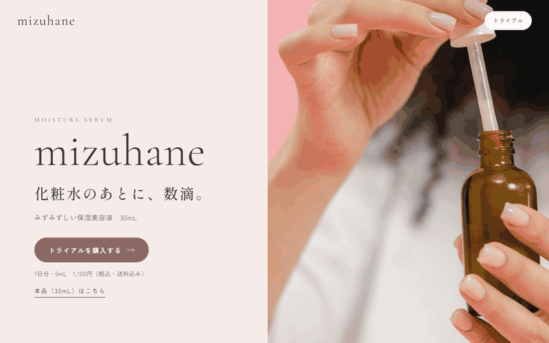

# mizuhane 保湿美容液 トライアル購入LP

mizuhane（架空の保湿美容液）のLPを、Claude Codeで設計〜実装しました。

副業ポートフォリオ用の作品例です。mizuhane（ミズハネ）は、保湿美容液1品だけを扱うという設定の**架空の化粧品ブランド**で、実在の商品ではありません。「トライアルを購入する」「本品を購入する」ボタンはダミーで、押しても購入はできません（ページのフッターにも同じ旨を表示しています）。

**公開ページ：https://tmy-adc329.github.io/Cosmetics-mizuhane-lp/**

## デモ

`index.html` をブラウザで直接開くだけで表示できます（ビルド不要。CSSはHTMLにインライン）。

## これは何

化粧水のあとに数滴なじませる保湿美容液「mizuhane」の、トライアル購入用の単品LPです。

- 商品：保湿美容液 30mL（スポイトタイプの茶色いガラスボトル）。保湿成分はセラミドNP・ヒアルロン酸Na、無香料・無着色
- 価格：トライアル（7日分・5mL）1,100円（税込・送料込み・お一人様1回まで）／本品（30mL）4,400円（税込）。定期便はなし
- ゴール：一次CTAは「トライアルを購入する」、二次CTAは「本品を購入する」

想定ターゲットは、乾燥が気になるけれどスキンケアの手順は増やしたくない、重いテクスチャーが苦手な30〜40代の女性です。いきなり本品を買うのは迷う人が多い前提で、まずトライアルで試してもらう導線にしています。「今だけ」「残りわずか」などの煽りは使わず、透明感のある落ち着いたトーンで書いています。

GijiLog（SaaS・登録型）、atelier soyogi（サロン・予約型）に続く、**物販・購入型**の作例です。

## ページ構成

| # | セクション | 役割 |
|---|---|---|
| 1 | ヒーロー | 商品写真を大きく、キャッチコピーとトライアル購入ボタン・価格 |
| 2 | こんな方へ | ターゲットの悩み3点を言語化して共感を作る |
| 3 | 特長 | 軽いテクスチャー／2つの保湿成分／無香料・無着色の3点 |
| 4 | テクスチャー | 質感を写真と言葉で伝える |
| 5 | 使い方 | 洗顔 → 化粧水 → 美容液2〜3滴の3ステップ |
| 6 | 配合成分 | 保湿成分の紹介と、全成分表示の枠 |
| 7 | お客様の声 | レイアウトのみ（下記「設計の考え方」参照） |
| 8 | 価格 | トライアルと本品を並べて比較 |
| 9 | よくある質問 | 開閉式のQ&A |
| 10 | 最終CTA | トライアル購入と本品購入 |
| 11 | フッター | 特定商取引法に基づく表記・プライバシーポリシーへのリンク枠 |

スマートフォン幅から組み始め、タブレット・デスクトップ幅へ段階的にレイアウトを広げています。

## 設計の考え方

**化粧品の広告ルールに合わせて書く。** 化粧品の広告は薬機法と「医薬品等適正広告基準」で表現が制限されます。架空の作例でも、実案件と同じルールで書いています。

- 効能は、国が定めた化粧品の効能の範囲内（「肌にうるおいを与える」など）で書いています
- 成分名を出すときは、必ず配合目的を添えています（例：セラミドNP（保湿成分））
- 使用前・使用後の比較写真や図、医師などによる推薦、「No.1」「満足度◯％」などの表記は使っていません
- 「無添加」とだけ書かず、何が入っていないか（無香料・無着色）を具体的に書いています。よくある質問でも「敏感肌でも安心」とは書かず、「すべての方の肌に合うわけではありません」と答えています
- 架空の口コミは使っていません。お客様の声はカードのレイアウトだけを作り、本文は画面上でも見本と分かる表示にしています

**写真は「商品として見せるもの」と「雰囲気」を分ける。** フリー素材（Unsplash / Pexels）をクライアント支給の写真とみなして使っています。

- 商品として見せる写真は、ボトルの見た目が揃うよう同じ撮影者の同じシリーズ（SHVETS production）だけにしています
- 顔が写り込んでいた写真は、トリミングで顔が入らないようにしています。人物を「愛用者」「お客様」として見せていません
- 水面の写真はうるおいのイメージとして使い、成分や製法とは結びつけていません。ブランドカラーに合わせてCSSで色味を調整しています
- 他社製品の成分表示が読めるラベルが写った写真や、「水のように軽い」という商品説明と食い違う、こってりしたクリームの写真は使っていません

**あとから直す人が迷わないようにする。** 受託を想定し、納品後にクライアント側で手を入れやすい形にしています。

- ブランドカラー（くすみピンク）は `:root` の `--brand` 1行だけで変更できます。淡い色・濃い色はそこから `color-mix()` で自動生成しています
- 全成分表示・お客様の声・特定商取引法に基づく表記など、実際の情報が必要な箇所は仮の文章で埋めず、`<!-- CLIENT: ... -->` コメントを付けたうえで、画面上でも未確定であることが分かる表示にしています

**参考デザインは「咀嚼して使う」。** 配色や構成の参考にはCanvaのテンプレートを複数使いましたが、特定の1枚を模倣せず、欧文セリフの大きな見出しと小さな和文の組み合わせ、罫線で区切ったリスト、色面と写真を左右に分けたヒーローといった要素を組み合わせて独自の構成にしています。テンプレートの画像や素材そのものは使っておらず、リポジトリにも含めていません（Canvaの規約上、テンプレートの再配布にあたるため）。

## 写真の出典

写真はすべて Unsplash / Pexels のフリー素材（商用利用可）です。Web表示用に縮小し、一部は顔が写り込んだ部分をトリミングしています。

| ファイル | 撮影者 / サイト | 元の写真 |
|---|---|---|
| `images/01_hero_bottle-dropper.jpg` | SHVETS production / Pexels | https://www.pexels.com/photo/close-up-of-a-person-holding-a-brown-bottle-and-a-dropper-9775170/ |
| `images/02_howto_hands.jpg` | SHVETS production / Pexels | https://www.pexels.com/photo/a-person-applying-serum-on-hands-9775174/ |
| `images/03_price_two-bottles.jpg` | SHVETS production / Pexels | https://www.pexels.com/photo/9775165/ |
| `images/04_texture_bottle.jpg` | SHVETS production / Pexels | https://www.pexels.com/photo/woman-holding-pipette-and-bottle-of-cream-9774793/ |
| `images/08_mood_ripples.jpg` | Jackson Hendry / Unsplash | https://unsplash.com/photos/concentric-ripples-on-calm-water-kKpTHqM2K-c |
| `images/09_bg_fabric.jpg` | Bharath Kumar / Unsplash | https://unsplash.com/photos/smooth-flowing-white-fabric-is-pictured-here-lOs0ZqaLQ1A |

## 技術スタック

- HTML / CSS（フレームワーク・ビルドツールなし、HTMLにインライン。JavaScriptは使っていません）
- Google Fonts（Cormorant Garamond / Shippori Mincho / Zen Kaku Gothic New）

## 開発について

設計と実装には Claude Code（AIコーディング支援）を使っています。
仕様（商品設定、ターゲット、CTA、価格、トーン、化粧品の表現ルール、写真の扱い、スコープ外の線引き）は
[brief.md](./brief.md) にまとめています。

## 今回やらないこと（スコープ外）

- カート・決済・定期便（購入ボタンのリンク先は仮）
- 全成分表示、特定商取引法に基づく表記、プライバシーポリシーの中身（枠のみ）
- ロゴのデザイン（テキストロゴで代替）
- 多言語対応

## ライセンス

個人のポートフォリオ／学習プロジェクトです。現時点でライセンスファイルは設定していません（無断転載・改変・商用利用は不可）。再利用可能な形にしたい場合は別途ライセンスを設定します。写真の権利は各撮影者に帰属し、Unsplash License / Pexels License に従います。
